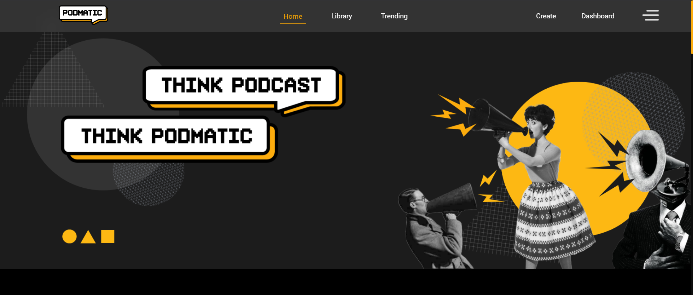

# Podmatic

 

Podmatic is an NFT marketplace for podcasters and fans. We aim to uplift podcasters by enabling them to create NFTs of their podcasts and provide them with the royalties and recognition that they deserve.

## Inspiration
In today’s world, Podcasters are struggling for monetary benefits for their work. The royalty distribution in its present form makes it difficult to keep the fair share of revenue podcasters generate on existing platforms. Moreover, there’s no transparent and decentralized platform for the same.

## What it does
Podmatic is a decentralized platform that aims to uplift podcasters by enabling them to create NFTs of their podcasts and provide them with the royalties and recognition that they deserve. Podmatic is more than just an NFT marketplace for podcasters and fans. It will bring them together like never before and unlock novel models of communications and commerce.

## How we built it
We have created a platform through which podcasters can raise money by selling their podcasts as NFTs, while fans can support and form closer connections with their idols by purchasing a real stake in their careers. It helps fans connect on a deeper level with their idols through all the features we have on the platform. By basing the Podmatic platform on the Polygon blockchain and storing all the tracks on IPFS, there is no central server and so the storage costs are drastically reduced. This allows for more of the revenue to go directly to the podcasters, in a more secure, transparent, and decentralized way than ever before.

## Challenges we ran into

- Bugs, bugs, and bugs.
- Integrating the chat system with blockchain was one of the biggest challenges for us. We’ve developed features like a chat room(whose members are all the NFT holders of a podcaster), and private chats(between NFT holder and podcaster). And this feature is automated. We don’t need to manually create rooms. Our community will reside on the platform itself.
- Writing Solidity code covering all the edge cases was a bit challenging, but we made sure our platform is secure to use.
- Making the platform’s UX smooth.
- The most important phase in the product development was thinking about what the podcast community really needed. We've talked to a lot of podcasters and think that we're very close to nailing it down to the minute details.

## Accomplishments that we're proud of
The team is very proud of turning around this project in a very short period of time during the hackathon.

## What we learned
We learnt several skills that included things from website development, web3, blockchain, crypto, NFTs, talking to people for gathering feedback, making the product a good market-fit, etc.

## Built With
- amazon-web-services
- filecoin
- html5
- ipfs
- polygon
- streamchat
- vercel

## Tech Used

### Frontend

### Smart Contract and Backend

### Other

IPFS, Ganache, Truffle, Polygon, Web3.js, Metamask, Infura, Moralis, Zapier, Stream

## How to setup

-   Fork the repo to your account

-   Clone the forked repo to your local system using `git clone https://github.com/<your-username>/Podmatic`

-   Connect your local repo to the upstream using `git remote add upstream https://github.com/<your-username>/Podmatic`

-   Run `npm install` to install npm dependencies

-   Start the local development blockchain on Ganache

-   Connect Metamask to local Ganache blockcahin

-   Run `truffle migrate --reset` in the terminal

-   Run `npm start` to start the React application

## How to contribute?

-   **DO NOT** make and push changes to the main branch!

-   **Always** keep your main/working branch in sync with the main repository `git pull upstream main` on the branch you are working on locally.

-   **Always create a new branch** before making any changes `git checkout -b <new-branch-name>`, never ever make any changes directly on the master/main branch.

## Running the Test Script

Just run: `truffle test`

## Migrate the Contract after making any changes inside the contracts folder

`truffle migrate --reset`

## Testing in Truffle console

-   Run: `truffle console`

-   `Podmatic.deployed().then(function(instance) {contract = instance})`

-   Test the deployed contract:

    `contract.address`

    `contract.name()`

    `contract.symbol()`

-   To check the created song:
    `contract.songs(0)`

## Migrating to Polygon Testnet

-   `truffle migrate --network polygonTestnet`
